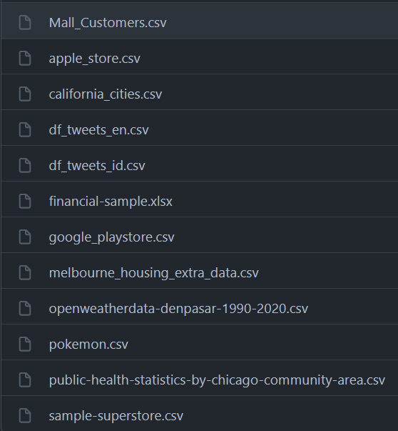
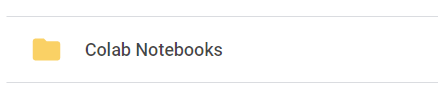
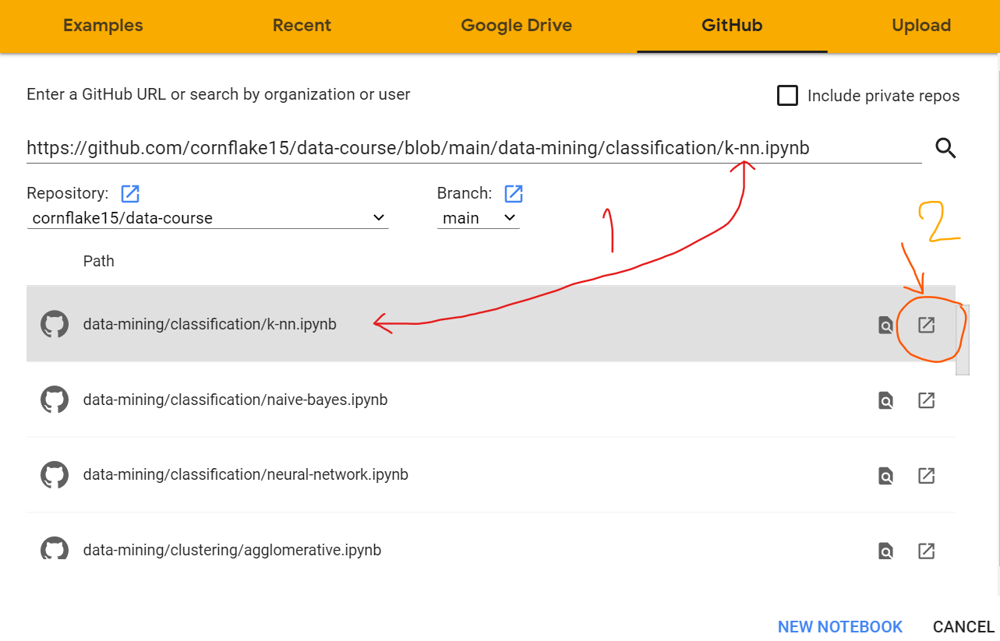
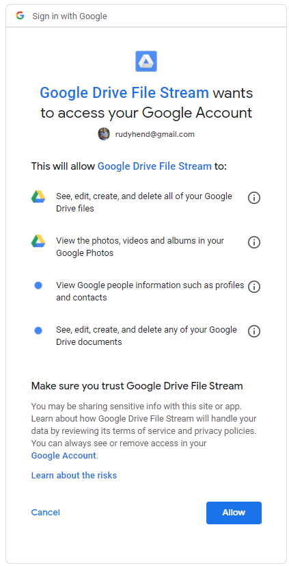
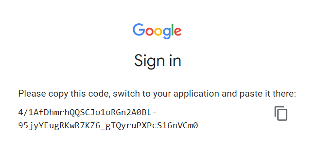
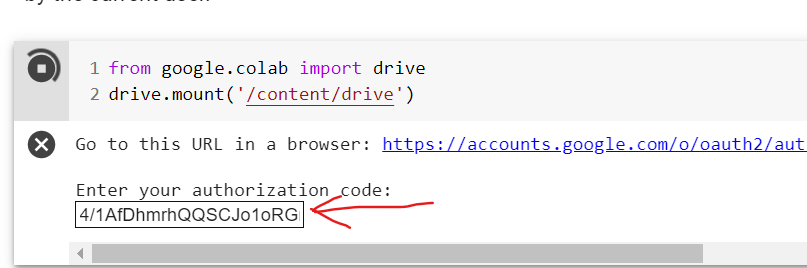

# Code Repository

Repositori ini berisi kode program Python dalam format Jupyter Notebook untuk keperluan mata kuliah Data Mining dan Data Visualization di Institut Teknologi dan Bisnis STIKOM Bali.

# Daftar Isi
Seluruh kode program masih dalam proses pengerjaan. :grimacing:

# Menggunakan Google Colab
Semua kode program di dalam repository ini secara teknis pasti bisa dijalankan pada platform Google Colabolatory. Namun untuk bisa menjalankan kode program dengan dataset eksternal perlu langkah-langkah tambahan yaitu sebagai berikut:
1. Download salah satu atau semua dataset di folder [datasets](datasets).

2. Akses Google Drive dengan menggunakan akun Google anda. Biasanya jika anda sudah pernah menggunakan Google Colab akan ada folder Colab Notebooks di direktor Google Drive anda.

3. Di dalam direktori tersebut, buatkan folder **`datasets`** untuk menyimpan file dataset.
4. Upload dokumen dataset ke folder **`datasets`**. 
5. Akses dataset pada Google Colab:
    - Jalankan kode program berikut pada shell pertama

        `from google.colab import drive`
        
        `drive.mount('/content/drive')`        

    - Akses link yang tersedia
    - Masuk dengan akun Google anda
    - Izinkan akses Google Colab ke Google Drive anda

    - Copy link yang tersedia ke shell Google Colab

6. Akses dataset yang terupload, misalnya dengan Pandas:

    `import pandas as pd`
    
    `df = pd.read_csv("/content/drive/My Drive/Colab Notebooks/nama_file.csv")`

7. Dataset sudah siap dipakai.

## License
Sebagian dari kode program ini didapatkan dari modifikasi kode program dari repositori [Python Data Science Handbook](https://github.com/jakevdp/PythonDataScienceHandbook) dan [Hands-On Machine Learning with Scikit-Learn & Tensorflow](https://github.com/ageron/handson-ml)

### Code
Semua kode program di dalam repositori ini berada di bawah naungan [MIT license](LICENSE-CODE). Baca lebih lanjut di [Open Source Initiative](https://opensource.org/licenses/MIT).

