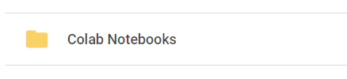
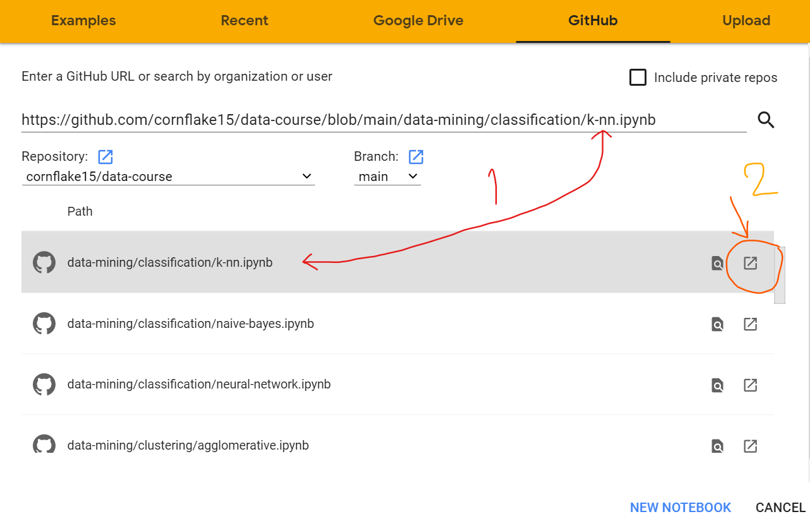
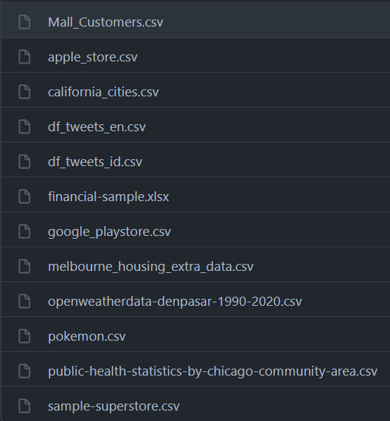
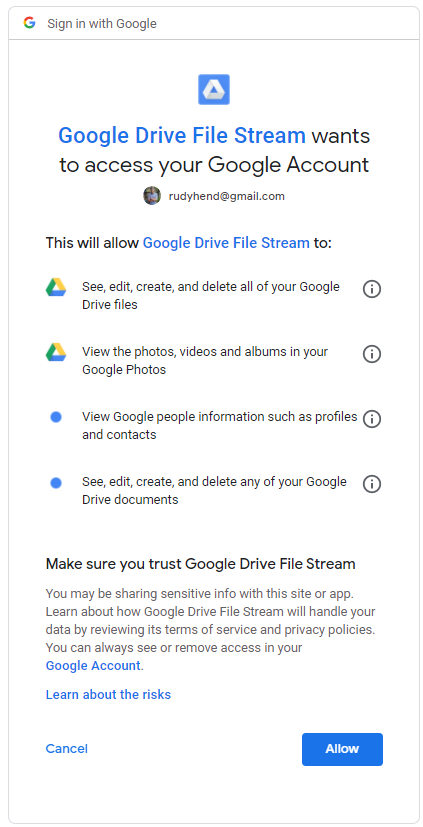

# Data Course

Repositori ini berisi materi praktikum dan contoh kode Python untuk topik-topik data, terutama dalam format **Jupyter Notebook**. Isi repo mencakup dasar Python numerik, visualisasi data, data preprocessing, data mining, workflow Orange, dataset pendukung, dan satu mini-project NLP.

Materi di repo ini ditujukan untuk kebutuhan pembelajaran dan eksplorasi konsep secara bertahap, dari dasar sampai implementasi yang lebih praktis.

## Struktur Repo

### 1. Data Mining
- [Classification](/data-mining/classification)
  - [K-NN](/data-mining/classification/k-nn.ipynb)
  - [Naive Bayes](/data-mining/classification/naive-bayes.ipynb)
  - [Decision Tree](/data-mining/classification/decision-tree.ipynb)
  - [C4.5 from Scratch](/data-mining/classification/C4.5-from-scratch.ipynb)
  - [Support Vector Machine](/data-mining/classification/support-vector-machine.ipynb)
  - [Neural Network](/data-mining/classification/neural-network.ipynb)
  - [Ensemble Methods](/data-mining/classification/ensemble-methods.ipynb)
- [Clustering](/data-mining/clustering)
  - [Agglomerative](/data-mining/clustering/agglomerative.ipynb)
  - [K-Means](/data-mining/clustering/k-means.ipynb)
- [Regression](/data-mining/regression)
  - [Least Square](/data-mining/regression/least_square.ipynb)
- [Orange Workflows](/data-mining/orange-workflows)
  - [K-NN Demo](/data-mining/orange-workflows/k-nn-demo.ows)
  - [Decision Tree Demo](/data-mining/orange-workflows/decision-tree-demo.ows)
  - [Naive Bayes Demo](/data-mining/orange-workflows/naive-bayes-demo.ows)
  - [K-Means Demo](/data-mining/orange-workflows/k-means-demo.ows)

### 2. Data Preparation
- [Data Prep Overview](/data-prep/data-prep.ipynb)
- [Image Data](/data-prep/img-data)
  - [Digital Image](/data-prep/img-data/01_digital_img.ipynb)
  - [Histogram](/data-prep/img-data/02_histogram.ipynb)
  - [Point Operations](/data-prep/img-data/03_point_operations.ipynb)
  - [Filters](/data-prep/img-data/04_filters.ipynb)
- [Text Data](/data-prep/text-data)
  - [01 Text Data Preprocessing](/data-prep/text-data/01_text_data_preprocessing.ipynb)
  - [01 General Flow Text Processing](/data-prep/text-data/01_general_flow_text_processing.ipynb)
  - [02 Text Data Preprocessing](/data-prep/text-data/02_text_data_preprocessing.ipynb)
  - [02 General Flow Text Processing](/data-prep/text-data/02_general_flow_text_processing.ipynb)
- [Video Data](/data-prep/video-data)
  - [README](/data-prep/video-data/README.md)
  - [01 Preprocessing](/data-prep/video-data/01_preprocessing.ipynb)

### 3. Data Visualization
- [Intro Matplotlib](/data-visualization/Intro-Matplotlib.ipynb)
- [Plot Categorical](/data-visualization/Plot-Categorical.ipynb)
- [Plot Hierarchy](/data-visualization/Plot-Hierarchy.ipynb)
- [Plot TimeSeries](/data-visualization/Plot-TimeSeries.ipynb)
- [Text Processing](/data-visualization/Text-Processing.ipynb)

### 4. Fundamental Python for Data
- [NumPy](/numpy)
  - [NumPy Basic](/numpy/numpy-basic.ipynb)
- [Pandas](/pandas)
  - [Pandas Indexing Selection](/pandas/Pandas-Indexing-Selection.ipynb)
  - [Pandas Hierarchical Indexing](/pandas/Pandas-Hierarchical-Indexing.ipynb)

### 5. Datasets
Dataset yang tersedia di direktori [`datasets`](/datasets):
- `Mall_Customers.csv`
- `adult_income.csv`
- `df_tweets_en.csv`
- `df_tweets_id.csv`
- `melbourne_housing_extra_data.csv`
- `openweatherdata-denpasar-1990-2020.csv`
- `pokemon.csv`
- `sample-superstore.csv`

### 6. Mini Project
- [Simple NLP App](/mini-project/Simple-NLP-App)
  - Backend FastAPI + PostgreSQL
  - Training pipeline TF-IDF + LinearSVC
  - Docker setup tersedia
  - Dokumentasi lengkap ada di [README mini-project](/mini-project/Simple-NLP-App/README.md)

## Menjalankan Notebook

### Lokal
Notebook dapat dibuka dengan Jupyter Notebook, JupyterLab, atau VS Code.

Langkah umum:
1. Buka repo ini di environment Python yang sesuai.
2. Jalankan Jupyter Notebook atau JupyterLab.
3. Buka notebook yang diinginkan dari direktori terkait.

Catatan:
- Beberapa notebook memakai `scikit-learn`, `pandas`, `numpy`, dan `matplotlib`.
- Mini-project memiliki dependensi sendiri di [mini-project/Simple-NLP-App/requirements.txt](/mini-project/Simple-NLP-App/requirements.txt).

### Google Colab
Sebagian besar notebook dapat dijalankan di Google Colab.

Langkah umum:
1. Buka [Google Colab](https://colab.research.google.com/).
2. Pilih tab `GitHub`.
3. Masukkan URL repositori ini.
4. Pilih notebook yang ingin dijalankan.

Panduan visual:
- 
- 

## Menggunakan Dataset di Google Colab

Jika ingin memakai dataset dari repo ini langsung di Colab:
1. Buka direktori [datasets](/datasets).
2. Pilih file dataset yang diinginkan.
3. Klik tombol `Raw`.
4. Salin URL file mentah tersebut ke notebook Colab.

Panduan visual:
- 
- 

## Catatan Konten

- Isi notebook di repo ini tidak semuanya berada pada tingkat kedalaman yang sama.
- Beberapa notebook fokus pada pengenalan konsep.
- Beberapa notebook lain sudah memuat implementasi yang lebih lengkap, visualisasi, dan evaluasi model.
- Materi akan lebih mudah diikuti jika dibaca per topik, bukan meloncat acak antar direktori.

## Lisensi

Referensi dan inspirasi kode/materi di repo ini berasal dari berbagai sumber terbuka, termasuk:
- [Python Data Science Handbook](https://github.com/jakevdp/PythonDataScienceHandbook)
- [Hands-On Machine Learning with Scikit-Learn & TensorFlow](https://github.com/ageron/handson-ml)
- [Scikit-learn](https://scikit-learn.org/stable/)
- [Matplotlib](https://matplotlib.org/)
- [Seaborn](https://seaborn.pydata.org/)
- [Pandas](https://pandas.pydata.org/)
- [NumPy](https://numpy.org/)

Dengan beberapa modifikasi untuk menyesuaikan kebutuhan pembelajaran.

### Code License
Semua kode program di repositori ini berada di bawah [MIT License](/LICENSE-CODE).

### Text License
Materi teks di repositori ini berada di bawah lisensi yang dijelaskan pada [LICENSE-TEXT](/LICENSE-TEXT).
